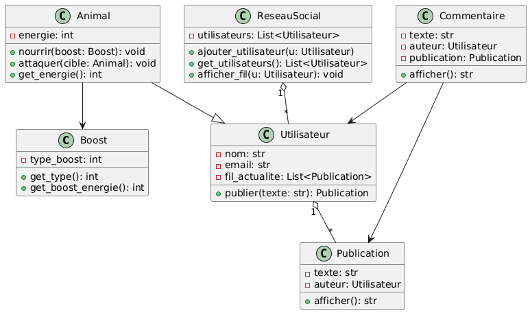

# 🐾 Simulation Sociale d'Animaux – Projet Fusionné

Ce projet simule un environnement dans lequel des animaux interagissent entre eux tout en partageant leurs actions à travers un système de réseau social intégré.  
Chaque animal peut effectuer des actions comme se nourrir à l’aide de boosts, attaquer d’autres animaux ou publier des messages.  
Toutes ces actions sont automatiquement enregistrées sous forme de publications visibles dans un fil d’actualité individuel.  
Les animaux peuvent également commenter les publications des autres, l’interaction et permet de suivre l’évolution de chaque participant dans le système.

---


## ⚙️ Fonctionnalités principales

- `Animal` hérite de `Utilisateur` et peut :
  - Utiliser un boost (énergie +60, +80, +120 selon type)
  - Attaquer un autre animal (-50 énergie)
  - Publier des messages textuels
  - Générer automatiquement des publications après chaque action
- `Commentaire` permet à un utilisateur de réagir à une publication
- `ReseauSocial` affiche le fil d’actualité d’un utilisateur

---

## 🧬 Diagramme de classes UML

Le diagramme ci-dessous présente les principales entités du projet ainsi que leurs relations :

- `Animal` hérite de `Utilisateur` : il possède les mêmes capacités de publication
- `Boost` est utilisé pour augmenter l'énergie d'un animal
- `Publication` et `Commentaire` permettent de suivre les actions dans un fil d’actualité
- `ReseauSocial` centralise l’ensemble des utilisateurs



## 📁 Structure du projet

```bash
Version_finale/
│
├── main.py                      ← Code principal (Boost, Animal, Publication, etc.)
│
├── features/                    ← Tests fonctionnels Gherkin (Behave)
│   ├── simulation_sociale_animaux.feature
│   └── steps/
│       └── steps.py
│
├── tests/                       ← Tests unitaires Python (unittest)
│   └── test_animaux.py
│
├── README.md                    ← ✅ Ce fichier
└── requirements.txt             ← (facultatif) Dépendances à installer
```

---

## 🧪 Lancer les tests

### ✅ 1. Tests fonctionnels (avec Behave)

```bash
pip install behave
behave
```

Ces tests vérifient :
- Que l’énergie change après un boost ou une attaque
- Que les publications sont générées correctement
- Que les messages manuels sont affichés dans le fil

### ✅ 2. Tests unitaires (avec unittest)

```bash
python -m unittest discover tests
```

Ces tests couvrent :
- L'utilisation d'un boost
- L'attaque entre deux animaux
- Les publications et commentaires
- La gestion d'une erreur de boost invalide

---


## 👨‍🎓 Auteur

Projet réalisé par **Abdelabrie El metni, Ons Hadrich, Wassim Derouiche et Nassima Seghir** .

---
